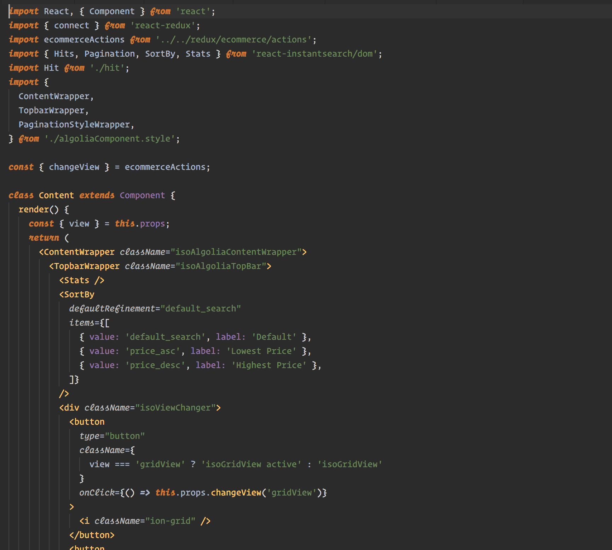
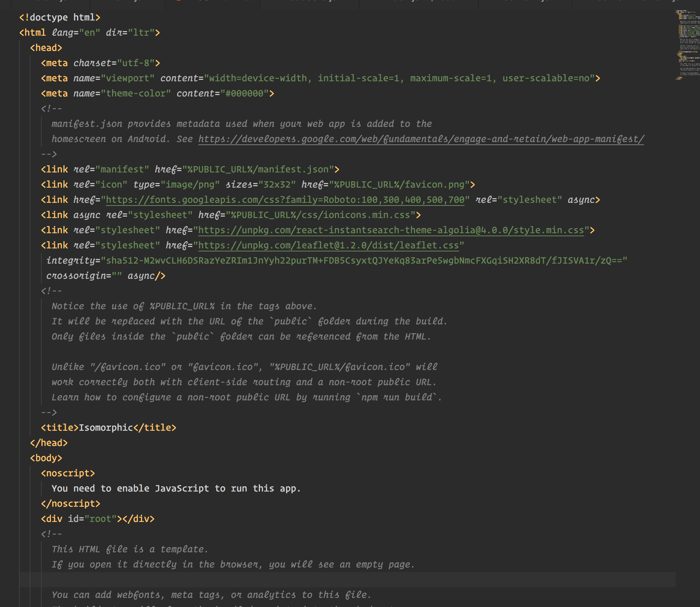

# Darcula theme with Operator Mono for VS Code

It requires to have [Operator Mono](https://www.typography.com/blog/introducing-operator) installed.




Also enable ligatures in settings.json:
```
"workbench.colorTheme": "Darcula Operator Mono",
"editor.fontLigatures": true,
"editor.fontFamily": "Operator Mono",
```
